<div align="center">


# Dispatch305 React Frontend 

     


</div>

## Table of Contents

1. [Description](#frontend)
1. [Install (Run) with Docker](#docker)
1. [Installation without Docker](#installation)
1. [Run with the Flask Backend (with and without Docker)](#connect_backend)
1. [Screenshots of the Frontend React App](#screenshots_frontend)
1. [Screenshots of the Admin Panel Backend](#screenshots)
1. [Screenshots of the Original Frontend Design](#screenshots_original)


<a name="frontend"></a>

## Description

__Dispatch305__ is a service that helps dispatchers to communicate with both drivers and brokers. From now on, we call __DISPATCH305__ to the company and all its components, and so we will often call  _drivers_ to the _clients_, while the _dispatchers_ will be called _staff members_ (of the company). In addition, the services offered by the website will be referred as:

- _Searching a Cargo_: When a client requests the dispatcher to look out for an Agency with a Cargo to transport. In this case the staff member should contact a broker (Agency) and make the arraignments.
- _Sending Analytics_: Every Friday, a bill should be sent to every client with the weekly pending bill amount and a description of the charges. In addition, for the clients with a VIP account, an analytics resume of the week should also be sent.
- _Managing POD_: When a Cargo is delivered, the VIP clients may request the staff member assigned to them to manage the sending of the _Rate Conf_ and the _POD_ (this are 2 PDF files needed as proof of service and delivery).

- ### How does Dispatch305 work?
1. __User Registration:__ First, the client registers at [dispatch305.com](https://www.dispatch305.com/create-account) (the Frontend website created using REACT js). During this step, the client should provide basic account information such as name, company, ..., and should also upload the 4 basic PDF files that most brokers require for hiring them to deliver cargo.
2. __Account Activation:__ When the new account is created, it is set to inactive and the _Admin User_ is notified. The, the _Admin User_ assigns a staff member to the client. From this point on, the staff member is said to be the client's dispatcher. The client must download the PDF that is under the section Agreement in the Frontend app. Once this steps are completed, the client's account is set to active.
3. __Requesting Services and Billing:__ Now and while the account is active, a client with a plan BASICO (basic account) can request the dispatcher to offer the service of _Searching a Cargo_, while VIP clients can ask for the services of _Searching a Cargo_, _Sending Analytics_, and  _Managing POD_. Regardless of which type of account a client has, a Bill will be sent to them with the pending amount to pay for the services offered in that week from DISPATCH305. When a user fails to pay the weekly bill (usually a timeline of 3 days offered), the account becomes inactive until the bill is paid.
4. __Factoring:__ After the user requests a _Searching a Cargo_ service, and the Cargo is found by the staff member, and later delivered by the client, if the client has a VIP account, the staff member can be requested to offer a _Managing POD_ service. In order to do that, the client must send the PDF files required, and the staff member should upload them to DISPATCH305's Admin Panel.


<a name="docker"></a>

## Install (Run) with Docker

1. Clone the repo:

   ```bash
   git clone https://github.com/Ceci-Aguilera/dispatch305_react_frontend.git
   ```

1. Install Docker and Docker Compose

1. Configure the environment variables: Create an .env file inside the root folder and set up the following environment variables:

   ```text
    REACT_APP_API_DOMAIN_NAME (The url of the backend, for example, https://backend_api.com)
   ```

1. Run the command:

   ```bash
   docker-compose up -d --build
   ```

1. Congratulations =) !!! the app should be running in [localhost:80](http://localhost:80)


<a name="installation"></a>

## Installation without Docker

1. Clone the repo:

   ```bash
   git clone https://github.com/Ceci-Aguilera/dispatch305_react_frontend.git
   ```

1. Install dependencies:
   ```bash
   npm install
   ```

1. Configure the environment variables: Create an .env file inside the root folder and set up the following environment variables:

   ```text
    REACT_APP_API_DOMAIN_NAME (The url of the backend, for example, https://backend_api.com)
   ```

1. Run the app

   ```bash
   npm start
   ```

1. Congratulations =) !!! the app should be running in [localhost:3000](http://localhost:3000)


<a name="connect_backend"></a>
## Run with the Flask Backend (with and without Docker)

__Note:__ Before following these steps clone this repository. From now on the selected folder that contains the clone will be referred as __project_root__. So far, it should look like this:
   ```sh
      project_root
      └── dispatch305_react_frontend
   ```

1. Assuming that your are at the __project_root__, clone the [Flask Backend API repository](https://github.com/Ceci-Aguilera/dispatch305_flask_backend_api):
   ```sh
      git clone https://github.com/Ceci-Aguilera/dispatch305_flask_backend_api.git
   ```
   Now the __project_root__ folder should look like:
      ```sh
      project_root
      ├── dispatch305_react_frontend
      └── dispatch305_flask_backend_api
   ```

- ### If Using Docker and Docker Compose
   1. Copy the content of the docker-compose-connect.yml to a new file docker-compose.yml in the __project_root__. The docker-compose-connect.yml file can be found at the root of this repository and also at the root of the [Flask Backend API repository](https://github.com/Ceci-Aguilera/dispatch305_flask_backend_api) (Either file is fine to copy).
   1. Follow the instruction to configure the environment variables of the __Flask__ backend API that can be found in the section __Install (Run) with Docker__ in the Readme.md of the [Flask Backend API repository](https://github.com/Ceci-Aguilera/dispatch305_flask_backend_api)
   1. Follow the instructions on the __Install (Run) with Docker__ section of this Readme.md to configure the environment variables for this repo. The only env variable needed is the Flask Backend url, which by default should be [http://localhost:5000](http://localhost:5000).
   __Note:__ Right now the __project_root__ should look like:
         ```sh
         project_root
         ├── dispatch305_react_frontend
         ├── dispatch305_flask_backend_api
         └── docker-compose.yml
      ```

   1. Run the command:

      ```bash
      docker-compose up --build
      ```

   1. Congratulations =) !!! the frontend app should be running in [localhost:80](http://localhost:80) while the backend is at [localhost:5000](http://localhost:5000)


- ### Running without Docker and Docker Compose
   1. Follow the instructions of the __Installation without Docker__ section in the Readme.md of the  [Flask Backend API repository](https://github.com/Ceci-Aguilera/dispatch305_flask_backend_api) to configure and run the backend.
   1. Follow the instructions of section __Installation without Docker__ of this Readme.md. Modify the REACT_APP_API_DOMAIN_NAME to be the url of the __Flask__ Backend API (by default it is [http://localhost:5050](http://localhost:5050)).
   1. Congratulations =) !!! the frontend app should be running in [localhost:3000](http://localhost:3000) while the backend is at [localhost:5050](http://localhost:5050)

---


<a name="screenshots_frontend"></a>

## Screenshots of the Frontend React App

<div align="center">

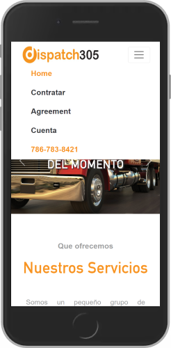 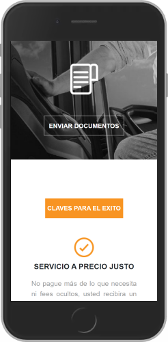

</div>

<div align="center">

 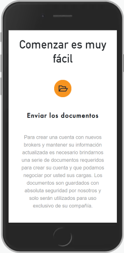

</div>

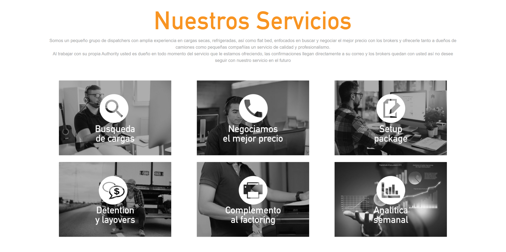

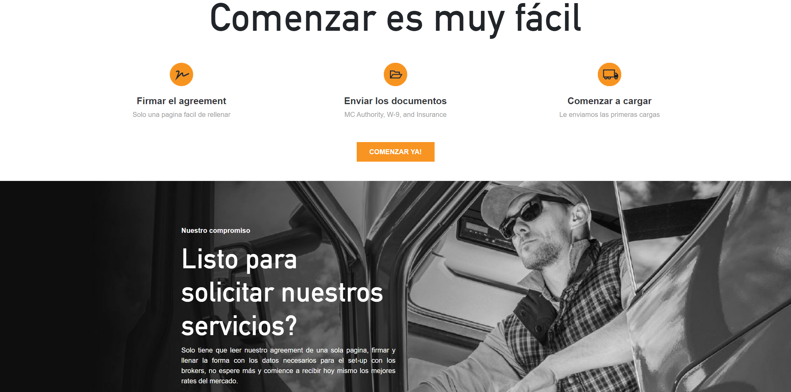


<a name="screenshots"></a>

### Screenshots of the Admin Panel

<div align="center">

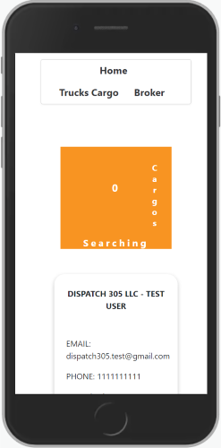  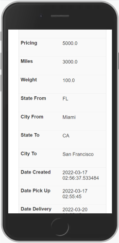

</div>

<div align="center">

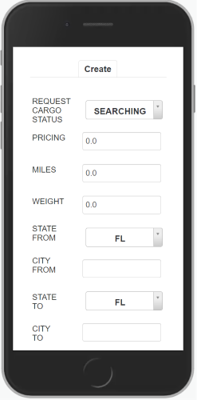  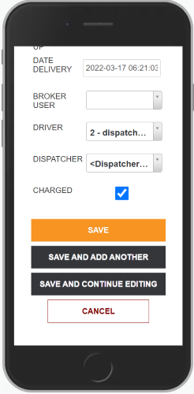

</div>

---

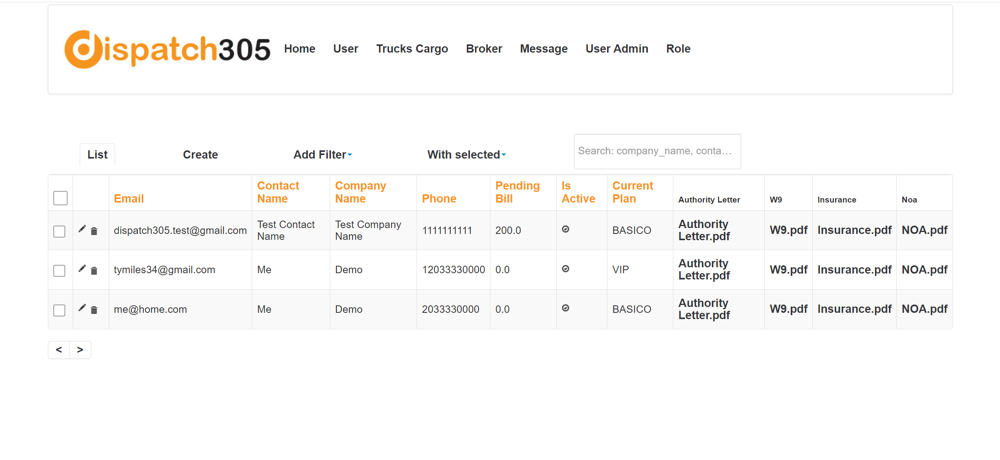

---

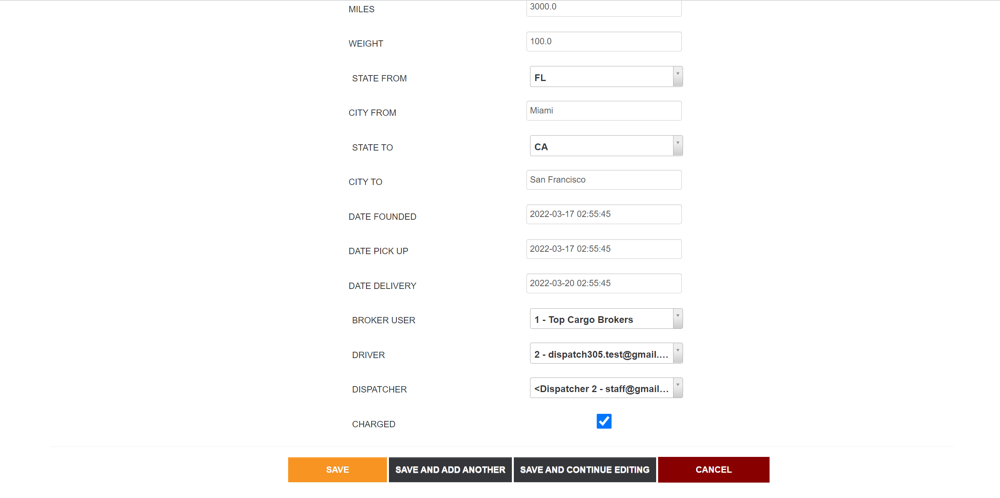


<a name="screenshots_original"></a>

### Screenshots of the Original Frontend Design

__NOTE:__ Some of the components of the original design have been changed, such as banner images, and name of the service (from ALL4LOADS to Dispatch305). This original design does not include the client's views after log in.


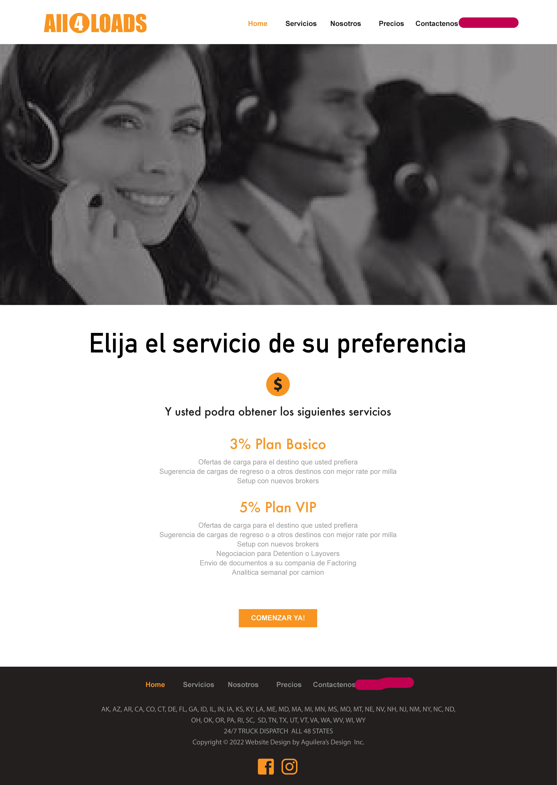